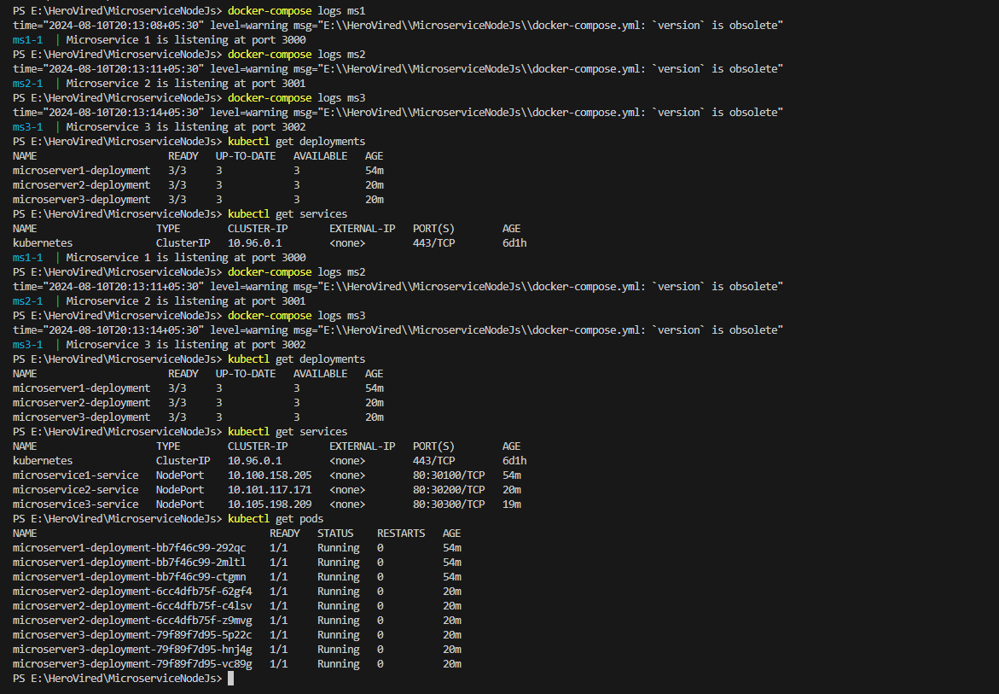
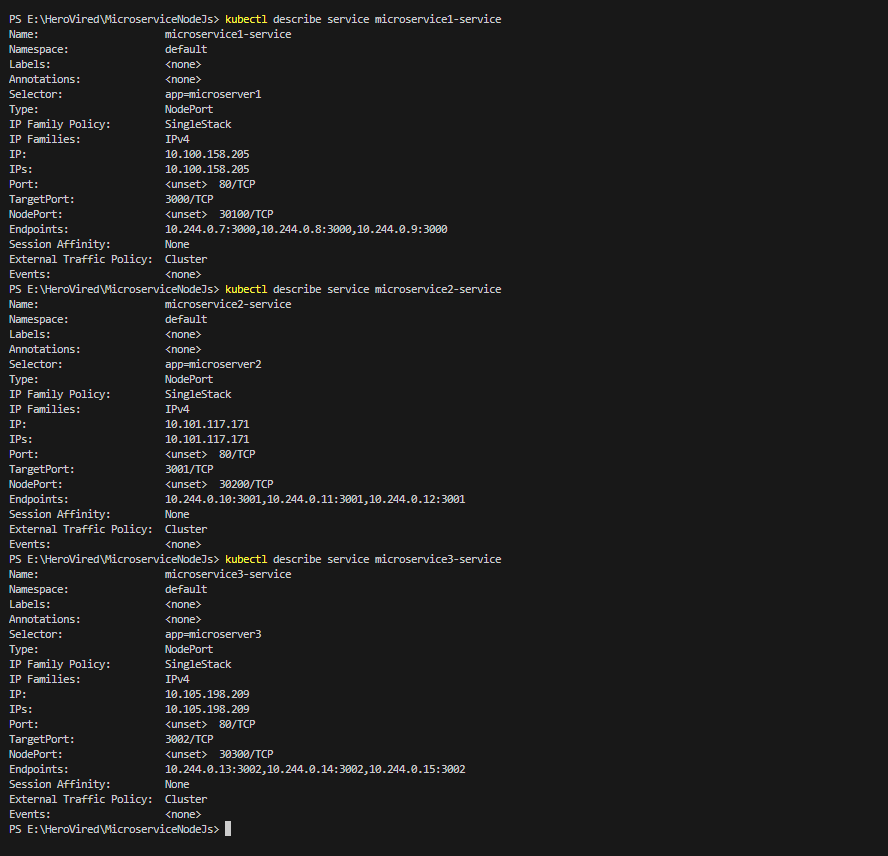

## Documentation for Microservices Deployment on Kubernetes

### **1. Setting Up Microservices**

We’ve set up three microservices: `microservice1`, `microservice2`, and `microservice3`. Here’s how we’ve done it:

#### **1.1 Building and Running with Docker Compose**

- **File:** `docker-compose.yml`
- **Description:** This file defines three services (ms1, ms2, ms3) and specifies how to build and run them using Docker Compose.

**Commands Used:**
```bash
docker-compose build
docker-compose up
```

This builds Docker images for each microservice and runs them in containers.

### **2. Deploying Microservices to Kubernetes**

We created Kubernetes deployments and services for each microservice. Here’s a summary:

#### **2.1 `microservice1`**

- **Deployment File:** `ms1-deployment.yml`
  - **Description:** Defines how to deploy `microservice1` with 3 replicas.
- **Service File:** `ms1-service.yml`
  - **Description:** Exposes `microservice1` on port 30100 as a NodePort service.

**Commands Used:**
```bash
kubectl apply -f ms1-deployment.yml
kubectl apply -f ms1-service.yml
```

#### **2.2 `microservice2`**

- **Deployment File:** `ms2-deployment.yml`
  - **Description:** Defines how to deploy `microservice2` with 3 replicas.
- **Service File:** `ms2-service.yml`
  - **Description:** Exposes `microservice2` on port 30200 as a NodePort service.

**Commands Used:**
```bash
kubectl apply -f ms2-deployment.yml
kubectl apply -f ms2-service.yml
```

#### **2.3 `microservice3`**

- **Deployment File:** `ms3-deployment.yml`
  - **Description:** Defines how to deploy `microservice3` with 3 replicas.
- **Service File:** `ms3-service.yml`
  - **Description:** Exposes `microservice3` on port 30300 as a NodePort service.

**Commands Used:**
```bash
kubectl apply -f ms3-deployment.yml
kubectl apply -f ms3-service.yml
```

### **3. Verifying Deployment and Services**

- **Check Deployments:**
  ```bash
  kubectl get deployments
  ```

- **Check Services:**
  ```bash
  kubectl get services
  ```

- **Check Pods:**
  ```bash
  kubectl get pods
  ```

### **4. Accessing Microservices**

- **Microservice 1:** `http://127.0.0.1:30100/`
- **Microservice 2:** `http://127.0.0.1:30200/`
- **Microservice 3:** `http://127.0.0.1:30300/`

---

Certainly! To make the commands and their outputs suitable for inclusion in a `README.md` file on GitHub, you should format them with proper markdown syntax for code blocks and add some descriptions if necessary. Here’s an updated version:

```markdown
## Docker Compose Logs

To view logs for the microservices, use the following commands:

```bash
docker-compose logs ms1
```

```bash
docker-compose logs ms2
```

```bash
docker-compose logs ms3
```

## Kubernetes Deployment and Service Information

To check the status of deployments, services, and pods in Kubernetes, use:

```bash
kubectl get deployments
```

```bash
kubectl get services
```

```bash
kubectl get pods
```

## Describe Kubernetes Services

To get detailed information about each service, use:

```bash
kubectl describe service microservice1-service
```

```bash
kubectl describe service microservice2-service
```

```bash
kubectl describe service microservice3-service
```

## Kubernetes Endpoints

To view the endpoints for the services, use:

```bash
kubectl get endpoints
```






